# GPU Manager CLI
Список доступных команд:

Запускает процесс мониторинга. Каждую минуту происходит сбор метрик
```
start
```

---
Останавливаем процесс мониторинга
```
stop
```
---
Вывод всех логов
```
show
```
---
Выход с программы
```
exit
```


# GPU Management & Monitoring System (v2.0)

Информационная система для управления доступом к вычислительным ресурсам GPU и мониторинга состояния системы в реальном времени.

## 🚀 Основные возможности
* **Web-панель администратора:** Полное управление жизненным циклом заявок пользователей.
* **Мониторинг GPU:** Сбор метрик температуры, свободной памяти и списка запущенных процессов.
* **Аудит подключений:** Регистрация всех входов пользователей в систему с анализом временных окон.
* **Гибридный режим:** Автоматическое переключение в режим эмуляции (Mock), если GPU NVIDIA не обнаружен.
* **gRPC Server:** Поддержка удаленного получения метрик сторонними сервисами.

## 🛠 Технологический стек
* **Backend:** Java 17, Apache Tomcat (Embedded), Jackson (JSON), gRPC.
* **Database:** H2 MVStore (высокопроизводительное Key-Value хранилище).
* **Frontend:** HTML5, CSS3 (Modern UI), JavaScript (Async/Fetch API).

## 📋 Инструкция по запуску

1. Соберите проект с помощью Gradle:
   ```
   ./gradlew build
   ```
2. Запустите основное приложение:
   ```
   ./gradlew run
   ```
3. Откройте в браузере: http://localhost:8080
   - **Логин:** admin
   - **Пароль:** admin123
  
## ⌨️ Консольные команды (CLI)

Интерфейс управления сервером через терминал:

| Команда | Описание |
| :--- | :--- |
| `start` | Запуск агента мониторинга GPU (интервал 60 сек) |
| `stop` | Остановка сбора метрик |
| `login <user>` | Имитация входа пользователя (запись в журнал подключений) |
| `create-request <user>` | Создание тестовой заявки на доступ |
| `approve-requests` | Массовое одобрение всех заявок |
| `show-logs` | Вывод истории подключений в консоль |
| `clear` | Полная очистка базы данных (заявки и логи) |
| `exit` | Корректное завершение работы серверов и сохранение БД |

## 🔍 Режим эмуляции
Если в системе не установлены драйверы NVIDIA или отсутствует утилита nvidia-smi, система выведет предупреждение:
ВНИМАНИЕ: nvidia-smi не найден. GPU-агент переходит в режим заглушки!!!
В этом режиме данные генерируются автоматически для возможности тестирования интерфейса.

## Скриншоты

<details>
  <summary>Нажмите, чтобы посмотреть скриншоты интерфейса</summary>
  
  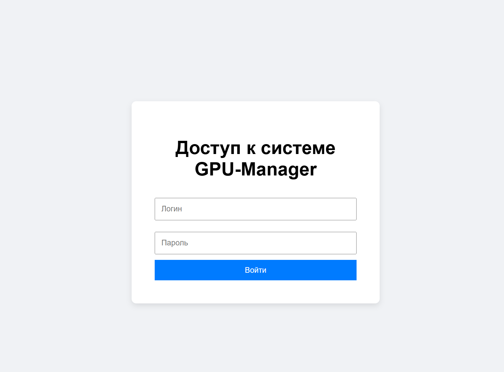
  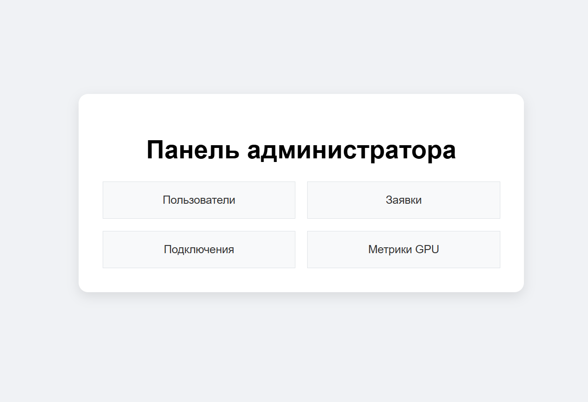
  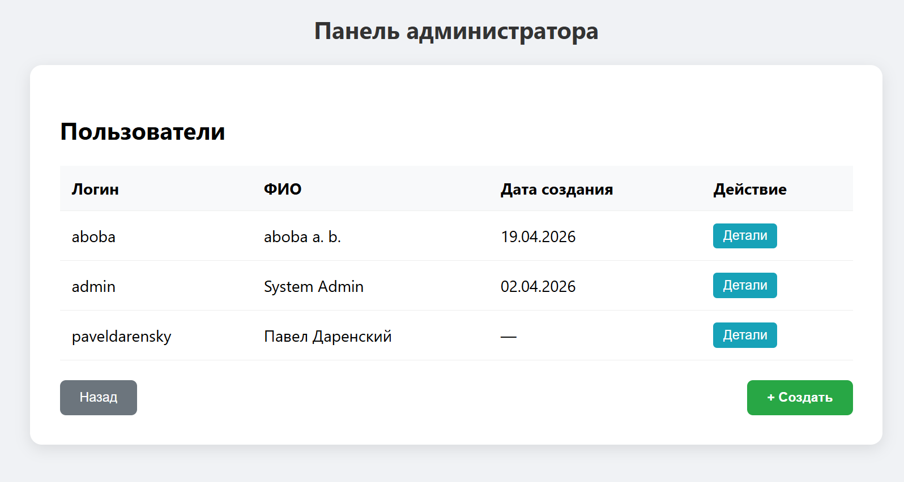
  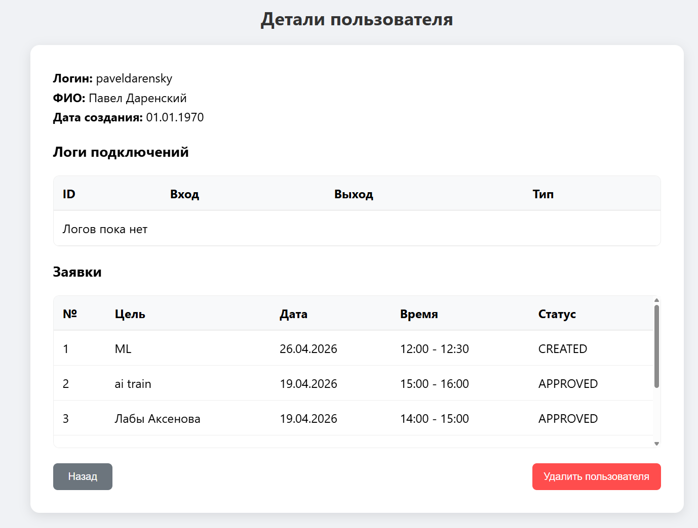
  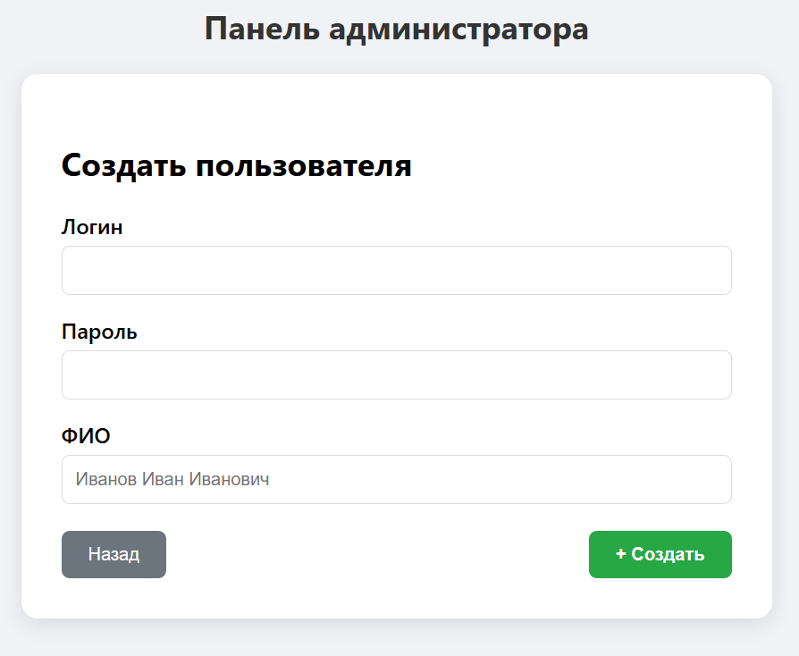
  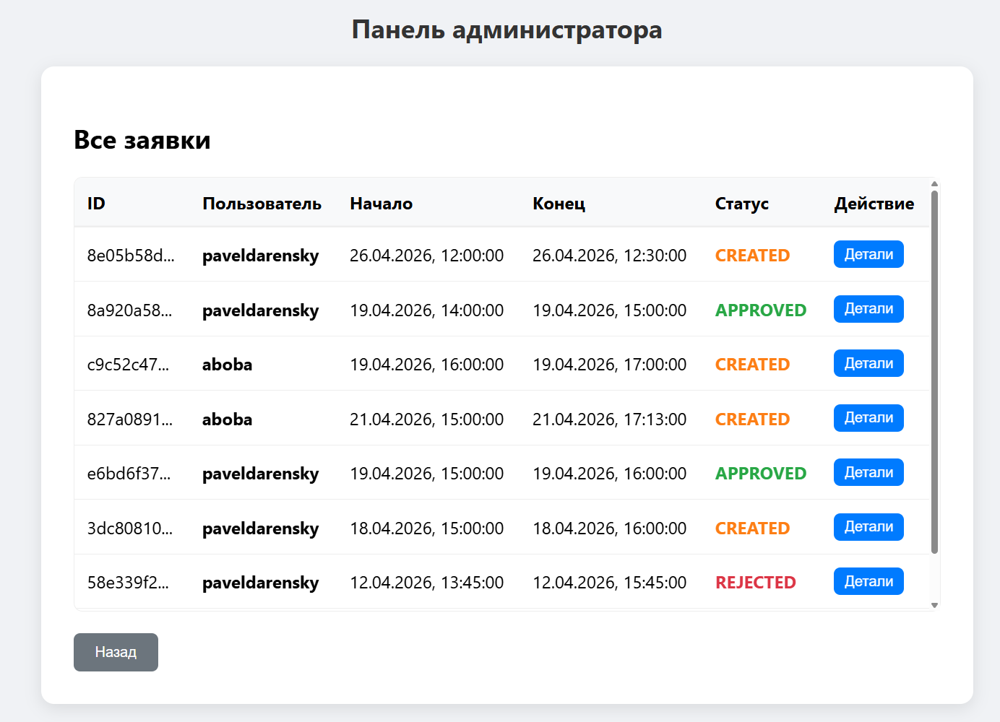
  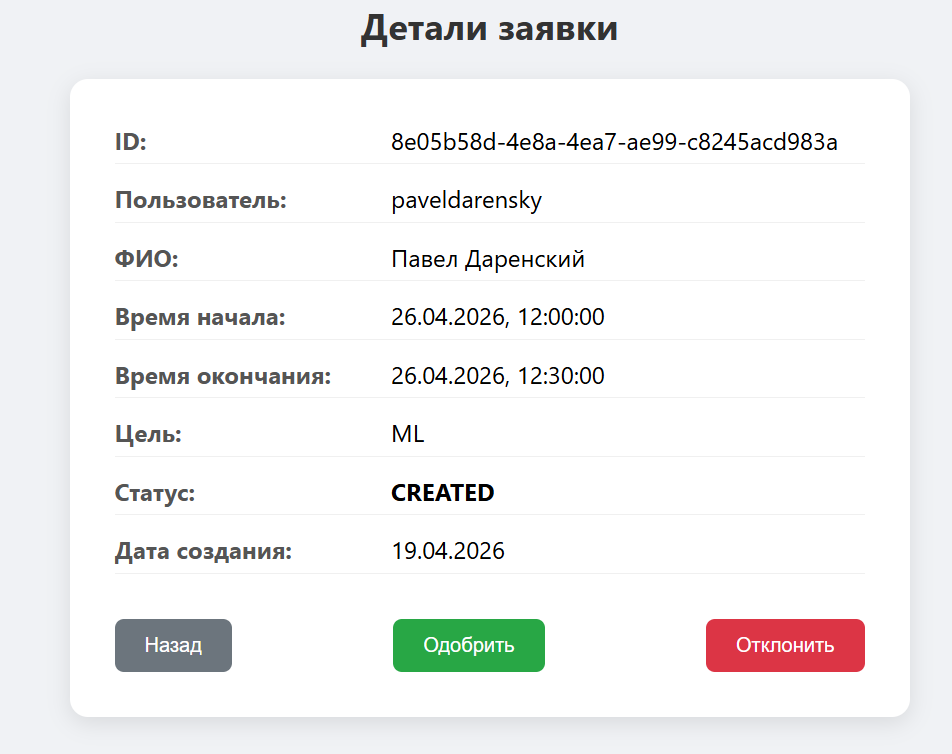
  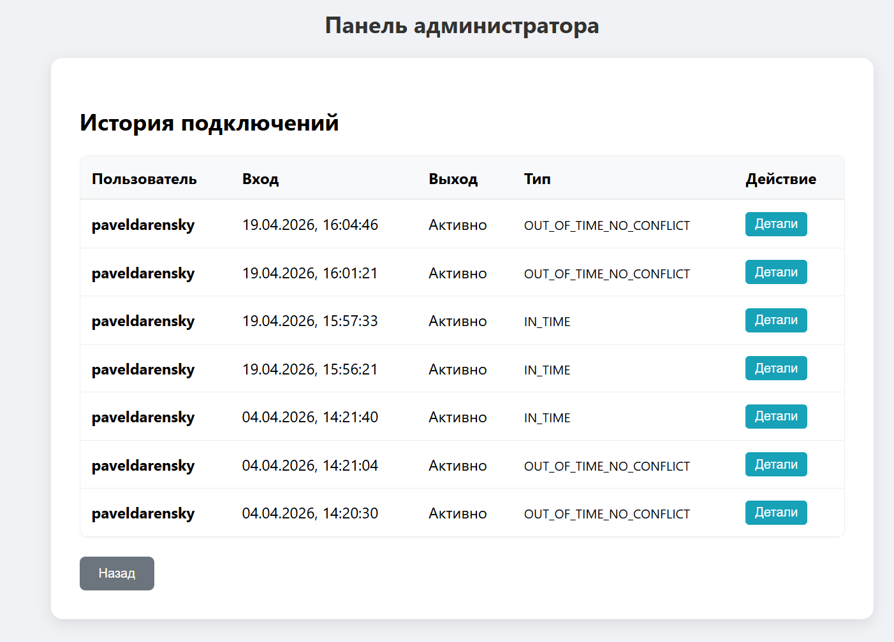
  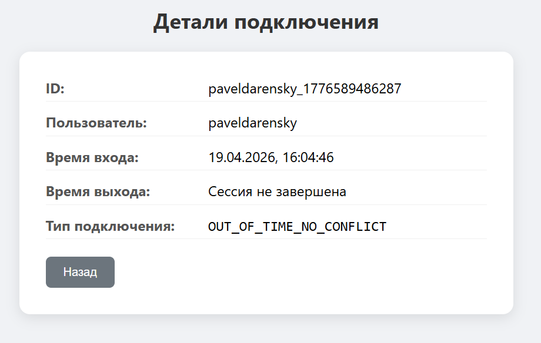
  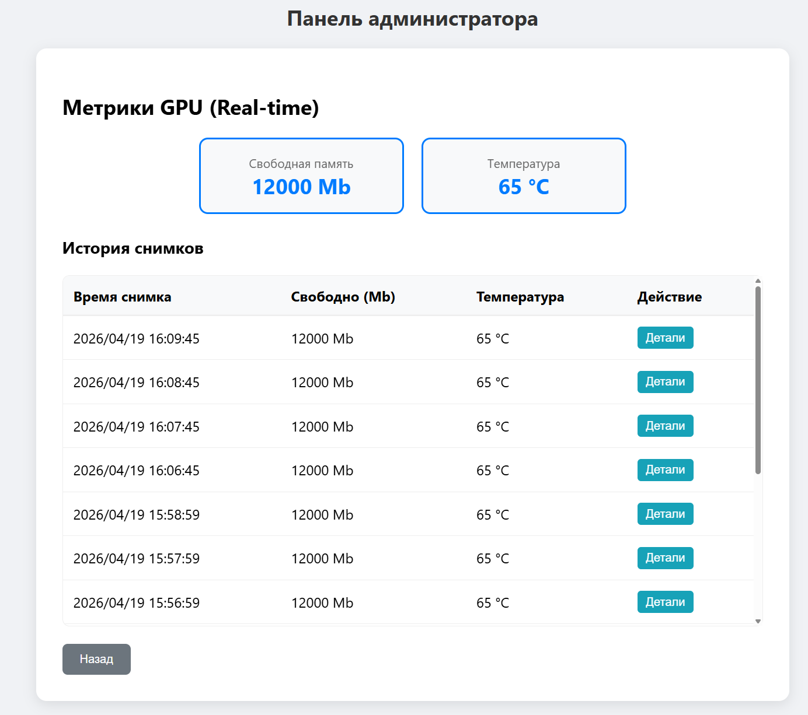
  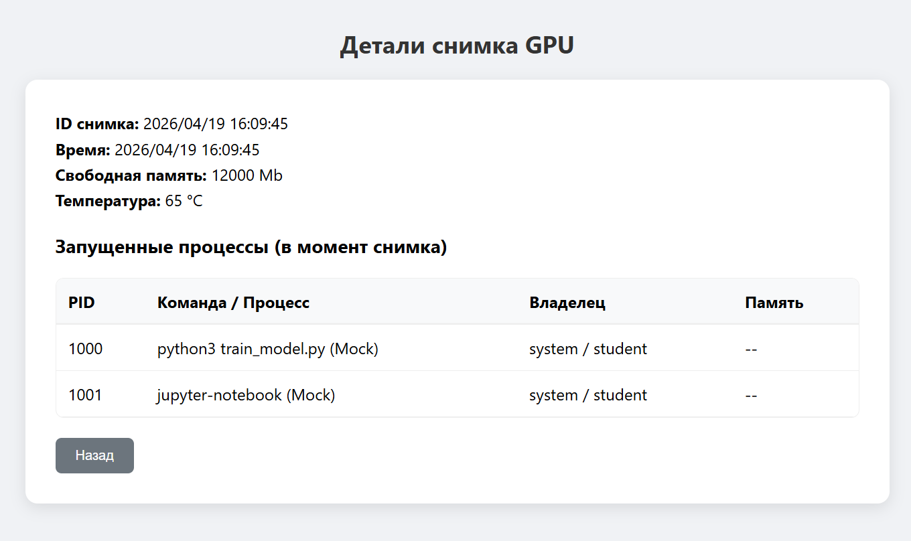
  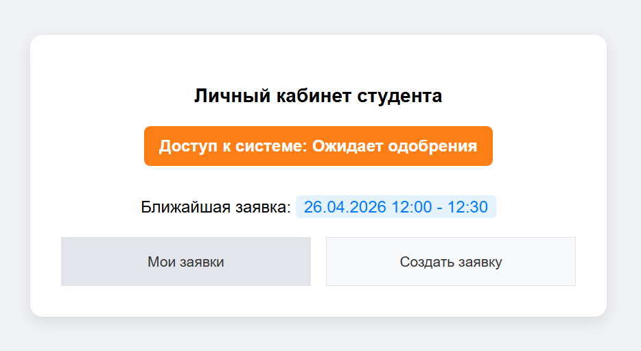
  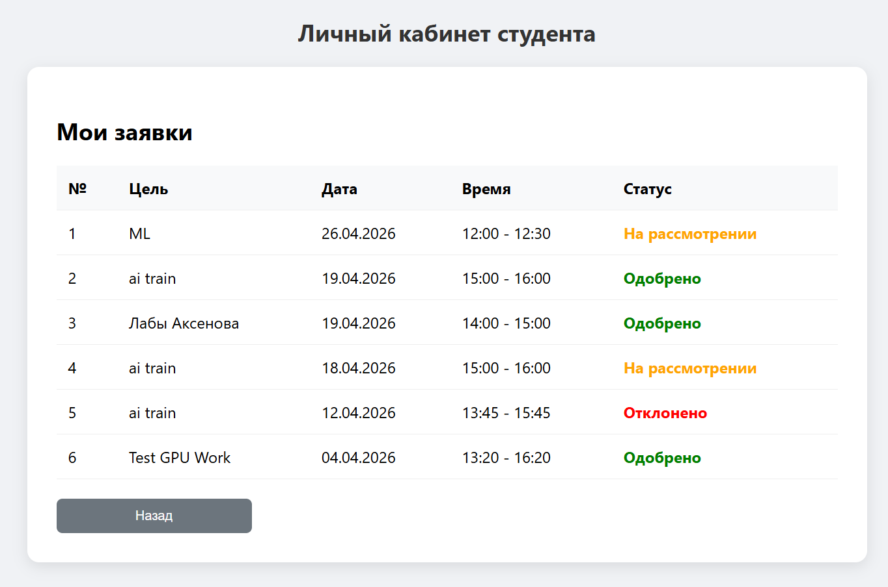
  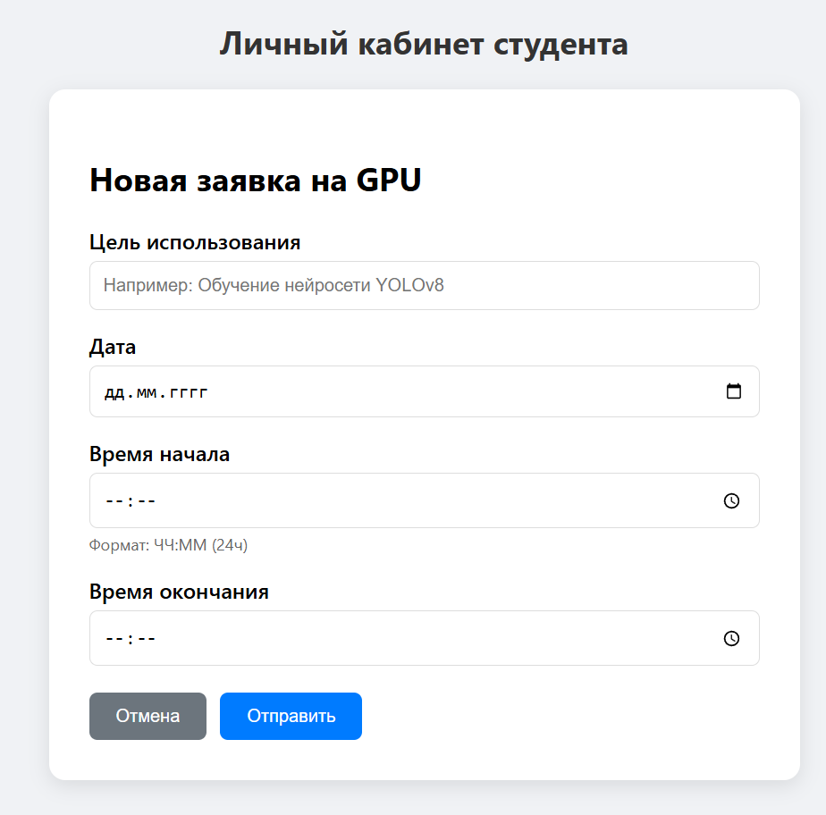
</details>
